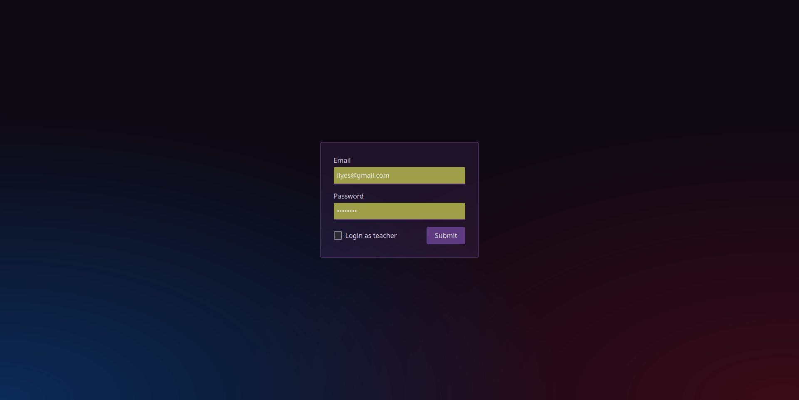
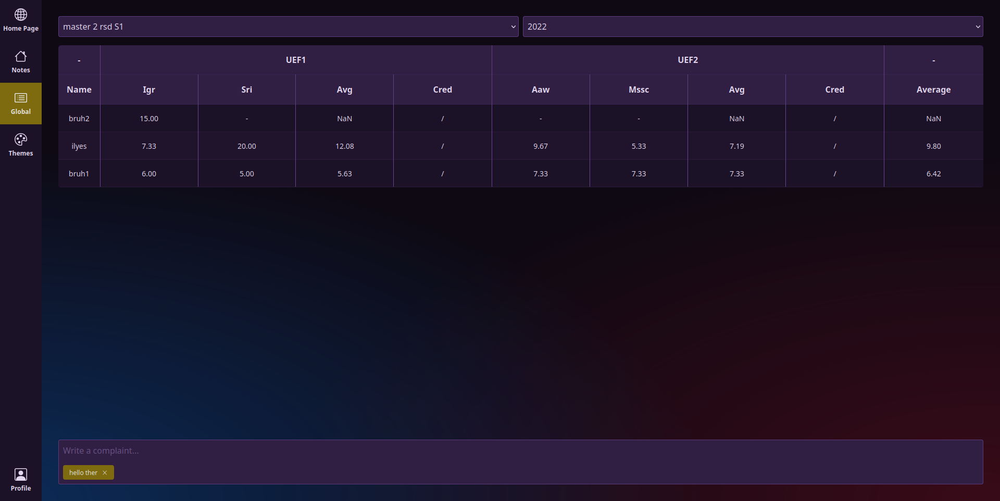
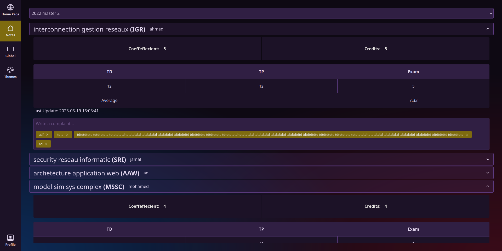
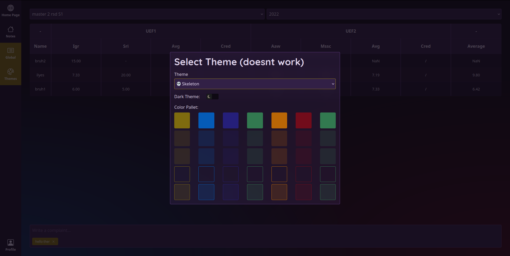

# students note management system ( school project )

front end sveltekit tailwind skeleton ui

backend express typescript

install and run both with 
```
npm install && npm run dev
```


|         |            |
| ------------- |:-------------:|
|       |   |
|        |   |


